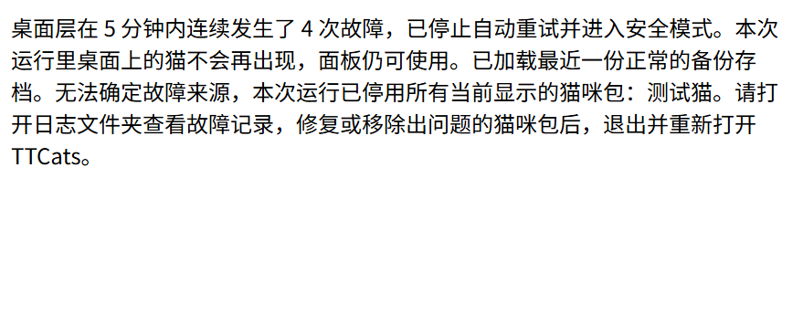

# 桌面层恢复与安全模式（#27）

正式入口的接线由 #28 完成。本 issue 只提供主进程模块，未修改仍是空面板的 `main/index.ts`、共享 IPC、preload 或其他模块。

## 恢复规则

- 每个桌面层调用一次 `attachRecovery(options)`。`render-process-gone` 的非正常退出在真实时间的滚动 5 分钟内允许重载 3 次；第 4 次停止重试并隐藏桌面层。
- 时间前跳/睡眠会释放过期额度；回拨会平移已有时间戳，保留故障间隔，不能借回拨无限重试。故障时间在收到事件时记录，重载排队不会改变计数。
- 页面加载完成后，原生 `unresponsive` 通知持续 10 秒会终止渲染进程。另外主进程每秒执行一次无副作用的 `executeJavaScript('0')`，超过 10 秒仍没有结果也会终止：实测原生通知可能缺失，不能只依靠它。加载期间不发送这个检查，改用独立的 120 秒加载上限，避免慢资源推迟执行而误判。短超时使用 `performance.now()`；系统时间回拨不影响它，主进程长暂停后重置检查，给恢复响应留出时间。
- 两种检查共用终止保护，最终只通过进程退出事件计数一次。强制崩溃没有产生退出事件时，2 秒后解除终止保护，不能让快速连点永久停用检查器。
- 重载期间的新崩溃也会排队，不丢失计数。Electron 可以先让加载 Promise reject，再报告进程崩溃；模块给 reject 留出 500 毫秒宽限期，收到崩溃通知后继续使用剩余重试次数。只有宽限期内没有新崩溃事件时才提示恢复失败。正常窗口关闭、整个程序退出均不会自动重启。
- 重新加载前恢复鼠标穿透。#28 仍需清理桌面层租约、拖动等窗口控制状态，不能让旧租约再次关闭穿透。

## 安全模式接入

`applySafeMode({ state, disabledCats, source })` **由主进程执行**，在显示提示之前完成：

1. 用 `state` 替换 core/game 的状态并广播新快照；状态来自 `SaveStore.loadLatestBackup()`，会跳过坏备份。没有备份时校验并使用 `defaultState()`，不读故障主存档。
2. 根据 `disabledCats` 过滤内容目录、猫咪包及片段，停止对这些包的加载和播放。不能只改 `visibleCats`，也不能删除原始猫咪包或改写用户的显示偏好。
3. 停止旧的游戏 tick 和自动写盘；不要把临时停用列表写回正常存档。恢复模块自身不写盘。存档模块没有取消待写队列的接口：#28 必须协调写盘，例如在进入安全模式后停止向原实例提交状态，待写数据由原实例按既有语义完成，临时安全模式状态使用单独的运行时状态。不能宣称仅靠本模块就取消了旧的存档任务。

只有内容加载/片段播放错误明确指出某只当前活动猫的 id 时，才由 `faultedCat()` 返回该 id，只停用这一个包。渲染进程退出理由并不包含可靠的猫 id；没有可靠证据或 id 不属于当前活动猫时，停用 `activeCats()` 返回的全部活动包。来源不能凭最近点击的猫来猜。停用和安全模式在本次运行内有效；修复/移除故障包后退出、重新打开即可重试。本次运行不恢复桌面层显示，安全模式下保留面板。#28 必须让托盘、全屏恢复等所有入口检查安全模式，不能重新显示或清零额度后无限重建桌面层。

`catName(id)` 从已校验的内容目录读取猫的名字。提示显示名字；已确定来源和无法确定来源用不同文字。内部的 `disabledCats` 仍是 id，不改共享接口或存档格式。

默认提示使用原生中文 `dialog.showMessageBox`，提供“打开日志文件夹”和“关闭”；没有备份、恢复失败都有单独说明。打开日志文件夹失败也会记录并提示，原存档不被覆盖。

`attachCrashCommand(ipcMain, allowedSender, recovery.crash)` 接入 #18 的 `debug/crashOverlay`。`allowedSender` 只允许主进程登记的面板/桌面层 id，模块还检查发件人必须是主框架。和现有命令路由使用同一通道，不新增共享接口。关闭窗口/退出时调用两个返回的清理函数。

## 验证

在仓库根目录执行：

```powershell
npm ci
npm run check
npm run build
npm run test:smoke
npx tsx app/src/main/recovery/desktop.verify.ts
```

最后一条是 Windows 独立桌面验收：在 `app/out/recovery-check/` 构建测试入口，用已经构建的正式 preload 发出四次崩溃命令，核对 3 次自动重载、备份状态、猫咪包停用结果、原存档字节不变及可见中文提示。还会分别在面板和桌面层抛出真实未捕获异常/rejection，核对文件日志；再启动另一实例，用无限循环真实卡死桌面层，确认主进程能重载。另有 3 个独立回归场景：真实慢资源加载期间反复崩溃（记录并断言先 reject 后 gone）、对死进程再发崩溃命令后验证后续命令有效、加载 12 秒的资源不会触发误杀。结果目录和中文提示窗口截图路径会输出，所有应用都在 finally 中退出，不接触用户正式数据目录。

桌面自动验收将原生提示替换成同文字的窗口，以便 Playwright 读到中文并截图；原生提示的按钮和打开日志文件夹调用由单元测试覆盖。没有人工点过原生按钮。没有做性能测试，也没有声称完成 #29 的整体验收。

2026-10-01 Windows 实测（Electron 44.5.1）：上述 5 个桌面场景通过，包括加载失败先于崩溃通知的顺序；加载中反复崩溃仍只重试 3 次并回退备份、停用猫咪包。真实卡死恢复用时约 11 秒；12 秒慢资源不会误判。具体命令结果和临时证据目录记在 PR 中；中文提示窗口截图随本模块保留：


