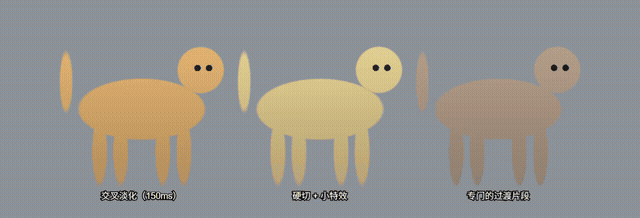
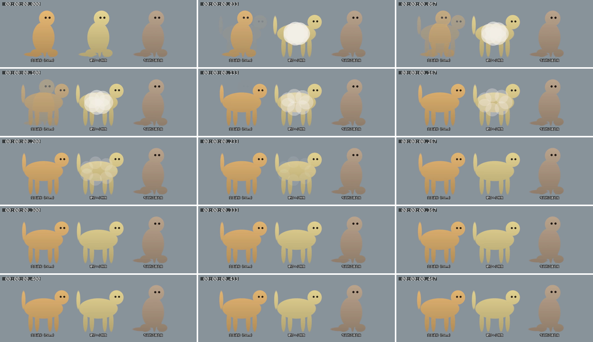
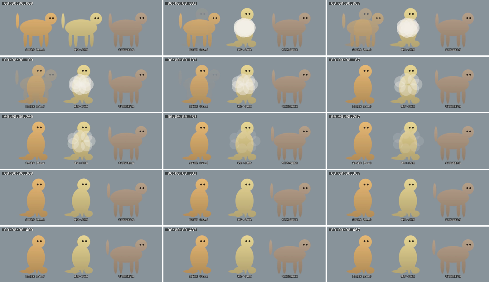

# M0-A 渲染与桌面交互验证报告

- 对应 issue：#2（所属 #1）
- 复现工程：[`experiments/overlay-spike/`](../../experiments/overlay-spike/README.md)
- 测试素材、录屏、原始数据：[`M0-A-渲染与交互-素材/`](M0-A-渲染与交互-素材/)
- 测试日期：2026-09-30
- 执行：Claude Code 会话（Opus 5.5）

## 结论速览

| 项目 | 结果 |
|---|---|
| PixiJS 视频纹理同时播放 3 只猫（VP9 透明 WebM） | ✅ 可行，透明边缘正常 |
| 按每帧点击遮罩判定、默认鼠标穿透 | ✅ 可行，150% 缩放下自动测试 23 项全部通过 |
| 防卡死（200ms 内恢复穿透） | ✅ 最慢 61ms，包括渲染进程卡死的情况 |
| 不抢焦点 | ✅ 在记事本和探针窗口里打字时点猫、拖猫，焦点和输入都没被抢走 |
| 截图隐身 | ✅ 系统截图、GDI 截图、Chromium 屏幕采集都截不到猫；微信、QQ、腾讯会议等**待手动实测** |
| 全屏检测 | ✅ `SHQueryUserNotificationState` 能检测到全屏窗口，桌面层随即隐藏并停止绘制 |
| 按真实时间结算 | ✅ 隐藏期间计时器和帧会被节流，按帧累加会算错，按真实时间正确；系统睡眠**待手动实测** |
| CPU（目标 < 2%） | ✅ 正常播放平均 0.1%（整机）、峰值 0.1%；隐藏时 0 |
| 内存（目标 < 700MB 私有内存，原为 < 300MB） | ✅ 正常播放私有内存约 450MB（工作集约 650MB）。原目标 300MB 低于空白透明全屏 Electron 窗口的底数（约 360MB），用户已决定改为 700MB，见第 10 节 |
| 不一直唤醒独显 | ⚠ Electron 在这台笔记本上**默认用独显**；加 `force_low_power_gpu` 开关后改用核显 |
| 打断时的衔接方式 | 建议：平常的姿势变化用过渡片段；用户触发的打断（拎起、点击）用硬切 + 小特效。**要用豆豆的真实片段复测** |

## 1. 环境

| 项目 | 版本 |
|---|---|
| 电脑 | 笔记本，AMD Radeon 780M 核显（驱动 32.0.12019.1028，接内屏）+ NVIDIA GeForce RTX 4060 Laptop 独显（驱动 32.0.15.6603），16 个逻辑 CPU |
| 系统 | Windows 11 家庭中文版 25H2，版本 10.0.26200.9445 |
| 屏幕 | 2880×1800，120Hz，系统缩放 150%（工作区 1920×1152 DIP） |
| Electron | 44.5.1（Chromium 152.0.7977.130，Node 24.21.0） |
| PixiJS | 8.21.0（WebGL，ANGLE / Direct3D 11） |
| koffi | 3.3.2 |
| ffmpeg | 8.1.1（gyan.dev full build） |
| 测试脚本运行时 | Node.js 24.15.0 |

## 2. 测试素材

由 `npm run gen:clips` 生成，全部是合成的"假猫"（椭圆拼成，有头、身体、四条腿、尾巴，腿之间留空隙），不含任何真实照片。

- 3 个姿势：站、坐、悬空。每个片段的第一帧和最后一帧严格等于某个姿势（ADR-0002 的姿势规则）。
- 3 个循环片段（2 秒 48 帧：呼吸、甩尾、晃动）+ 6 个过渡片段（0.75 秒 18 帧，姿势之间两两过渡）。
- 384×384，24fps，VP9 + 透明通道（`yuva420p`，`alpha_mode=1`），边缘 2.5 像素半透明羽化。每个片段 17～32KB。
- 点击遮罩：每帧 96×96（缩小 4 倍），平均不透明度 ≥ 50% 的格子算"猫身上"，1 位/像素，每帧 1152 字节。
- 显示时缩放 0.55～0.8 倍，站着时约 150～190 DIP 高。

豆豆的真实片段（#7，M0-F）还没做出来，**本次没有用真实片段复测**。真实片段做好后需要用 `npm start -- --layout=demo` 换上真实片段再看一遍衔接效果（见第 9 节）。

## 3. 桌面层怎么实现的

- 一个透明、无边框、置顶、`focusable: false` 的窗口覆盖主屏工作区。实测窗口样式带有 `WS_EX_NOACTIVATE`（不抢焦点）、`WS_EX_TOPMOST`，默认 `setIgnoreMouseEvents(true, { forward: true })` 带有 `WS_EX_TRANSPARENT`（鼠标穿透）。
- 渲染进程收到转发来的 `mousemove`，按猫**当前帧**的点击遮罩判断鼠标是否在猫的不透明像素上。当前帧由 `requestVideoFrameCallback` 的 `mediaTime × 24` 得到（视频元素不挂在页面上也能正常回调）。
- 在猫身上时，渲染进程每 50ms 向主进程续一次"租约"，主进程关闭穿透；离开时立刻恢复穿透。
- **防卡死**由主进程兜底，每 20ms 检查一次：
  - 租约超过 120ms 没续（比如渲染进程卡死）→ 恢复穿透；
  - 系统光标已经不在桌面层范围里（比如移到任务栏）→ 恢复穿透；
  - 拖动中但左键已松开超过 60ms（松手事件丢了）→ 结束拖动、恢复穿透。
- **拖动**：按下时渲染进程 `setPointerCapture`，拖动全程由窗口接收鼠标，鼠标甩出猫的范围、甚至甩出桌面层都不会丢。
- **幽灵模式**：主进程用 koffi 每 20ms 读一次 `GetAsyncKeyState(VK_CONTROL)`。按住 Ctrl → 猫变 35% 不透明、强制穿透；松开后保持 2 秒。**已经拎起的猫按 Ctrl 不会被扔下**，松手后再进入穿透。
- **全屏检测**：主进程每 500ms 调一次 `SHQueryUserNotificationState`，返回 2/3/4（有全屏程序、D3D 全屏、演示模式）时隐藏桌面层，渲染进程停掉 PixiJS 的 ticker 并暂停所有视频。
- **截图隐身**：`setContentProtection(true)`（Windows 上是 `WDA_EXCLUDEFROMCAPTURE`）。
- **需要存档的状态**：演示用的"饱腹"每分钟降 1 点，只由主进程按 `Date.now()` 计算，定时把快照推给渲染进程（ADR-0004）。

### 实测中发现、必须这样做的地方

1. **不能用 `mouseleave` 判断鼠标离开窗口。** 窗口处于"穿透 + 转发"状态时，Chromium 会在转发的 `mousemove` 之后误发 `mouseleave`，结果第一次移到猫身上时判定失效，点击落到了下面的窗口。改成由主进程检查系统光标位置后解决。
2. **双显卡笔记本上 Electron 默认用独显。** 实测 Chromium 的 GPU 进程默认跑在 RTX 4060 上（Windows 图形设置里没有为 electron.exe 设置偏好）。只设置 WebGL 的 `powerPreference: 'low-power'` 不起作用，必须加 Chromium 开关 `force_low_power_gpu`，之后改用 780M 核显。
3. **画面刷新率要限制。** 默认跟显示器 120Hz 走，整屏透明画布每秒重画 120 次，核显 3D 占用约 16%；限制到 30fps（片段本身只有 24fps）后降到约 4%，看不出区别。

## 4. 打断时的三种衔接方式

录屏：[`interrupts.mp4`](M0-A-渲染与交互-素材/interrupts.mp4)（16 秒），动图：

左：交叉淡化 150ms；中：硬切 + 小特效（一团 260ms 的烟）；右：专门的过渡片段。每 2.6 秒三只猫同时被打断一次（站 ↔ 坐）。

逐帧对比（30fps，打断前 0.1 秒到打断后 0.4 秒，从左到右、从上到下）：

站 → 坐：

坐 → 站：

| 方式 | 从打断到新片段开始动 | 看起来怎么样 |
|---|---|---|
| 交叉淡化 150ms | 平均约 29ms（全部预加载）/ 40ms（按需加载） | 两个姿势差别大时，能看到约 100ms 的"重影"：新旧两个轮廓叠在一起、都半透明 |
| 硬切 + 小特效 | 平均约 35ms / 53ms | 形状瞬间变了，但被烟团盖住，眼睛基本察觉不到跳变；烟团本身比较显眼 |
| 专门的过渡片段 | 平均约 1.2 秒，最长约 2 秒 | 最自然、完全没有跳变；但要等当前循环片段播回姿势才开始，反应明显慢 |

"从打断到新片段开始动"是从发出打断到新片段第一帧呈现（`requestVideoFrameCallback`）的时间。"过渡片段"方式包括等当前循环片段回到姿势的时间；循环片段 2 秒长，所以平均等 1 秒左右。

**拎起**（拖动）不能等 1 秒，所以"过渡片段"方式下拎起也是立刻切进"X → 悬空"的过渡片段。合成素材的循环片段离姿势很近，这样切几乎看不出来；真实的走路片段离"站"的姿势可能差很多，要用真实片段再确认。

**结论（暂定，要用真实片段复测）**：

- **平常的姿势变化**（猫自己决定去坐、去睡）不算打断，本来就等片段回到姿势再播过渡片段，效果最好，保持不变。
- **用户触发的打断**（拎起、点击、召唤）需要马上有反应，建议用**硬切 + 小特效**。交叉淡化在姿势差别大时有明显重影，只适合前后两个画面很像的情况（比如同一姿势的两个循环片段之间）。
- 特效要按猫咪包的数据来（比如"扬起一点毛"），不能每次都是同一团烟，否则会看腻。

## 5. 点击判定和桌面交互测试

`npm run interaction-test`，用 `SendInput` 发系统级鼠标键盘事件，猫下面放一个独立进程的"探针窗口"，记录它收到的点击和打字。

| 场景 | 测试项 | 结果 | 实测 |
|---|---|---|---|
| 基础 | 窗口样式 | ✅ | 不抢焦点 `WS_EX_NOACTIVATE`、置顶 `WS_EX_TOPMOST`、默认穿透 `WS_EX_TRANSPARENT` 都在 |
| 基础 | 点空白处 | ✅ | 落到下面的窗口 |
| 基础 | 鼠标移到猫身上后关闭穿透 | ✅ | 16ms |
| 基础 | 悬停后点猫 | ✅ | 猫接住 |
| 基础 | 点猫包围框内的透明处（两腿之间） | ✅ | 落到下面的窗口（说明是按像素判定，不是按矩形） |
| 快速移到猫身上马上点 | 移动后隔多久点击一定能点中猫 | ✅ | 隔 ≥ 5ms 时 5/5 点中；0ms 时 5 次里 4 次丢失（见下文） |
| 快速移到猫身上马上点 | 刚离开猫就点旁边的空白处 | ✅ | 隔 ≥ 5ms 时 5/5 落到下面的窗口；0ms 时 5 次里 1 次被桌面层"吃掉" |
| 拖动时鼠标移出猫的范围 | 一下子甩出很远、甩出桌面层（到任务栏）再回来 | ✅ | 全程由桌面层接收，猫跟到松手位置，下面的窗口收到 0 个事件 |
| 拖动时鼠标移出猫的范围 | 松手后离开猫 | ✅ | 13ms 恢复穿透，之后点空白处正常落到下面的窗口 |
| 按住 Ctrl 拖动 | 先按 Ctrl 再拖猫 | ✅ | 猫变半透明（35%），鼠标穿过猫，下面的窗口收到带 Ctrl 的按下，猫没动 |
| 按住 Ctrl 拖动 | 松开 Ctrl 后保持 2 秒 | ✅ | 松开约 1 秒时点猫 → 下面的窗口；约 2.6 秒时点猫 → 猫 |
| 按住 Ctrl 拖动 | 拖到一半按 Ctrl | ✅ | 继续拖完，猫到了松手位置；松手后 16ms 恢复穿透（光标还在猫身上） |
| 两只猫重叠 | 两只猫都不透明的地方 | ✅ | 前面的猫接住 |
| 两只猫重叠 | 只有后面的猫的地方 | ✅ | 后面的猫接住 |
| 两只猫重叠 | 只有前面的猫的地方 | ✅ | 前面的猫接住 |
| 两只猫重叠 | 猫的腿缝，也没被另一只猫盖住 | ✅ | 落到下面的窗口 |
| 焦点 | 在探针窗口打字时点猫、拖猫，再继续打字 | ✅ | 输入框内容 "abcdef"，前台窗口没变 |
| 焦点 | 在**记事本**里打字时点猫，再继续打字 | ✅ | 记事本仍在前台，内容 "abcdef" |
| 防卡死 | 从猫身上移到空白处 | ✅ | 14ms 恢复穿透 |
| 防卡死 | 从猫身上移到桌面层外面（任务栏） | ✅ | 30ms 恢复穿透（主进程检查光标位置） |
| 防卡死 | 渲染进程卡死 1 秒时从猫身上移开 | ✅ | 61ms 恢复穿透（租约过期），200ms 时点空白处正常落到下面的窗口 |

### 显示缩放

| 缩放 | 结果 |
|---|---|
| 150%（这台电脑平时的设置） | ✅ 23 项全部通过（[原始数据](M0-A-渲染与交互-素材/interaction-150pct.json)） |
| 125% | **待手动实测**（步骤见 README"手动测试步骤 A"） |
| 100% | **待手动实测** |

Windows 的显示缩放没法由程序安全地自动切换。测试脚本本身按系统报告的缩放比例换算坐标，所有坐标计算都已经按 150% 验证过。

### 值得注意的现象

- **鼠标移到猫身上后 0ms 就按下**（同一瞬间），5 次里有 4 次点击"丢失"：猫和下面的窗口都没收到。间隔 ≥ 5ms 就 100% 由猫接住。
- 反方向，**刚离开猫 0ms 就点旁边的空白处**，5 次里有 1 次被桌面层"吃掉"（下面的窗口没收到）。间隔 ≥ 5ms 就全部正常。
- 真人不可能在移动鼠标的同一毫秒按下，所以不影响使用；但这说明切换"穿透/不穿透"有几毫秒的生效时间。
- 测试期间同一台电脑上还有一个 Codex 会话在用"电脑操作"工具移动鼠标（issue #3）。测试脚本会检查光标是否被别人移动过，被打断的场景自动重做；报告里的结果都是没被打断的那一次。

## 6. 截图隐身

`npm run capture-test`：在洋红色窗口上放一只猫，在"截图里显示猫"开/关两种状态下，取猫身上那个像素的颜色。

| 截图方式 | 截图里显示猫 = 开（不保护） | 截图里显示猫 = 关（保护，默认） |
|---|---|---|
| GDI BitBlt（ffmpeg gdigrab） | 能看到猫 | 看不到猫（截到背后的洋红色） |
| Chromium 屏幕采集（desktopCapturer） | 能看到猫 | 看不到猫（截到背后的洋红色） |
| Win+Shift+S（系统截图工具） | 能看到猫 | 看不到猫（截到背后的洋红色） |

[原始数据](M0-A-渲染与交互-素材/capture.json)。每次还会同时取一个猫上方的"背景点"，确认背景确实是洋红色、测试画面没被别的窗口挡住。

开启隐身后截到的是**猫后面的窗口**（洋红色），不是黑块，说明 Electron 用的是 `WDA_EXCLUDEFROMCAPTURE`（Windows 10 2004 以上）。

| 软件 | 结果 |
|---|---|
| Win+Shift+S（系统截图工具） | ✅ 截不到猫（自动测试） |
| GDI 截图（QQ、微信等老截图工具常用的做法） | ✅ 截不到猫（自动测试，用 ffmpeg gdigrab 模拟） |
| Chromium 屏幕采集（浏览器、Electron 类会议软件共享屏幕的做法） | ✅ 截不到猫（自动测试） |
| 微信截图 | **待手动实测** |
| QQ 截图 | **待手动实测** |
| 腾讯会议共享屏幕 | **待手动实测** |
| Teams / Zoom 共享屏幕 | **待手动实测**（这台电脑没装 Zoom，装了新版 Teams） |
| OBS | **待手动实测**（这台电脑没装 OBS） |

另外：ffmpeg 的 `ddagrab`（DXGI 桌面复制）在这台双显卡笔记本上报 "Selected output not supported"，无法使用，所以没有单独测 DXGI 桌面复制；Chromium 的屏幕采集在 Windows 上默认也是走 DXGI 或 Windows.Graphics.Capture。

## 7. 全屏检测、隐藏与计时

### 全屏检测

打开一个全屏窗口并点一下让它成为前台窗口后，`SHQueryUserNotificationState` 返回 2（QUNS_BUSY），桌面层随即隐藏、停止绘制（主进程每 500ms 查一次，所以最多晚 0.5 秒）；关掉全屏窗口后 12ms 桌面层恢复显示。全屏期间桌面层 CPU 和 GPU 占用都是 0（见第 8 节）。

我们自己的桌面层虽然置顶并覆盖整个工作区，但不会被误判为"全屏程序"（测试全程返回 5，即 QUNS_ACCEPTS_NOTIFICATIONS）。

### 隐藏后计时器被节流的情况

桌面层隐藏（`win.hide()`）后，渲染进程里的计时器和 `requestAnimationFrame` 实际跑了多少次：

| 隐藏多久 | 1 秒一次的计时器实际跑了几次 | `requestAnimationFrame` 跑了几次 | 按帧累加算出过了多久 | 按计时器次数算出过了多久 | 按真实时间算出过了多久 |
|---|---|---|---|---|---|
| 30 秒 | 31 次（应为 30） | 70 次 | 约 1 秒 | 约 31 秒 | 30 秒 ✅ |
| 5 分钟（用户隐藏全部猫） | 66 次（应为 300） | 134 次 | 约 2 秒 | 约 66 秒 | 300 秒 ✅ |
| 5 分钟（全屏自动隐藏） | 66 次（应为 301） | 133 次 | 约 2 秒 | 约 66 秒 | 301 秒 ✅ |
| 5 分钟（另一次作废的测试里） | 38 次（应为 300） | 134 次 | 约 2 秒 | 约 38 秒 | 300 秒 ✅ |

`requestAnimationFrame` 在隐藏后大约 2～3 秒内就停了；计时器前几十秒基本正常，之后被 Chromium 大幅节流，而且每次节流程度不一样（38～66 次）。

"按帧数累加"：每帧按 1/60 秒算时间（错误做法）；"按计时器次数累加"：每次 1 秒的 `setInterval` 算 1 秒（错误做法）；"按真实时间"：主进程用 `Date.now()` 算经过了多久（ADR-0004 的做法）。

结论：窗口隐藏后 `requestAnimationFrame` 几乎停掉，按帧累加的时间严重偏少；计时器也会被节流。只有按真实经过的时间结算是对的，**ADR-0004 的做法成立**。

### 系统睡眠

主进程已经监听 `powerMonitor` 的 `suspend`/`resume`，唤醒后按真实时间结算并写入 `results/power-events.jsonl`。让电脑睡眠需要人来唤醒，**待手动实测**（步骤见 README"手动测试步骤 C"）。

## 8. 性能

`npm run perf`，统计桌面层程序**所有进程**（主进程、GPU 进程、渲染进程、工具进程），每秒采一次，每个状态测 5 分钟，开头 15 秒过渡期不计入。GPU 占用来自 Windows 性能计数器 GPU Engine（只算桌面层自己的进程）。

**独占说明**：正式数据测试期间，脚本每 15 秒检查一次，**没有其他会话的 Electron 程序（electron.exe）或素材工厂（python、ComfyUI）在运行**（两轮都通过）。电脑上常驻的 Claude、ChatGPT/Codex 桌面程序本身一直开着，但它们不是"其他会话运行的 Electron 测试程序"。在这之前有两轮正式测试因为 Codex 会话在反复启动它的 Electron 测试程序（issue #3），或者独占检查把自己的子进程也算了进去，按规则作废重测。

### 正式数据（核显，限 30fps，按需加载片段）

| 状态 | CPU 平均 / 峰值（整机%） | CPU 平均（单核%） | 核显 3D 占用 平均 / 峰值 | 工作集 平均 / 峰值（MB） | 私有内存 平均 / 峰值（MB） |
|---|---|---|---|---|---|
| 正常播放 | 0.1 / 0.1 | 1.7 | 4.4% / 6% | 649 / 672 | 453 / 482 |
| 全部隐藏 | 0 / 0 | 0 | 0% / 0% | 586 / 589 | 401 / 404 |
| 全屏时自动隐藏 | 0 / 0 | 0 | 0% / 0% | 587 / 590 | 401 / 403 |

按进程拆开（正常播放，工作集平均）：主进程 120MB，GPU 进程 325MB，渲染进程 157MB，工具进程 48MB。

原始数据：[`perf-igpu-summary.json`](M0-A-渲染与交互-素材/perf-igpu-summary.json)。

### 对比：Electron 默认选择（这台笔记本上是独显）

| 状态 | CPU 平均 / 峰值（整机%） | 独显 3D 平均 / 峰值 | 独显 Copy 引擎 平均 | 工作集 平均 / 峰值（MB） | 私有内存 平均 / 峰值（MB） |
|---|---|---|---|---|---|
| 正常播放 | 0.1 / 0.1 | 0.9% / 14% | 4.1% | 547 / 566 | 504 / 535 |
| 全部隐藏 | 0 / 0 | 0% / 0% | 0% | 508 / 510 | 456 / 460 |

用独显时，画面在独显上画好后还要拷贝到接屏幕的核显上（Copy 引擎一直约 4%），而且只要程序开着，Chromium 的 GPU 进程就一直挂在独显上，**隐藏时也一样**，独显没法进入休眠。私有内存反而多约 50MB。所以正式程序要强制用核显。
原始数据：[`perf-dgpu-summary.json`](M0-A-渲染与交互-素材/perf-dgpu-summary.json)。

### 对比：不同设置下正常播放的开销

以下是各 1 分钟的探索性测量，只用来比较设置之间的差别。**测的时候没有做独占检查**（同一台电脑上 Codex 会话可能在运行），绝对值仅供参考。全部用核显。

| 设置 | CPU 平均（整机%） | CPU 平均（单核%） | 工作集平均（MB） | 私有内存平均（MB） | 核显 3D 占用平均 |
|---|---|---|---|---|---|
| 空白透明窗口（基线，`--bare`） | 0 | 0.1 | 360 | 170 | 0% |
| 全部预加载，不限帧率 | 0.2 | 3.3 | 736 | 540 | 16.7% |
| 按需加载，不限帧率 | 0.2 | 3.1 | 645 | 445 | 16.0% |
| 全部预加载，限 30fps | 0.1 | 2.4 | 679 | 488 | 3.9% |
| 按需加载，限 30fps | 0.1 | 1.8 | 628 | 433 | 3.7% |
| 按需加载，限 30fps，画布 1 倍分辨率 | 0.1 | 2.3 | 595 | 394 | 3.6% |

画布降到 1 倍分辨率在 150% 缩放的屏幕上会变模糊，省下的内存不多（约 35MB），不建议。

- CPU 百分比按"整台电脑"算（16 个逻辑 CPU）；"单核"是换算成占一个核心的百分比。
- "工作集"包括共享的系统库和核显映射的显存，比任务管理器"内存"一栏（私有工作集）偏大；"私有内存"是进程自己提交的内存。
- 用核显时，显存就是系统内存的一部分，会算进 GPU 进程的工作集。

### 内存为什么超标

空白的透明全屏 Electron 窗口（不加载 PixiJS、不播视频）就要约 360MB 工作集、170MB 私有内存：主进程约 110MB，GPU 进程约 125MB，渲染进程约 80MB，网络等工具进程约 47MB。3 只猫加上 PixiJS 和视频解码再多出约 250MB，大头在 GPU 进程（全屏 2880×1728 的透明画布和它的交换缓冲区、视频解码缓冲区）。

可能的优化方向（都还没做，需要先定目标）：

- 把"内存"目标改成按私有内存或任务管理器的"内存"一栏来算；
- 桌面层画布不铺满整个屏幕，只覆盖猫活动的地板区域（会影响跳上窗口顶边等玩法）；
- 片段分辨率降到刚好够用；
- 更少的同时解码的视频。

### 备选方案的内存预算：把短循环片段预先解码成图片

每帧按 RGBA 4 字节，24fps、2 秒（48 帧）：

| 片段尺寸 | 一个片段 | 3 只猫各 1 个循环片段 | 3 只猫各 3 个循环片段（站、坐、睡） |
|---|---|---|---|
| 300×300（100% 缩放下 150 像素高的 2 倍） | 17.3MB | 52MB | 156MB |
| 384×384（本次测试素材） | 28.3MB | 85MB | 255MB |
| 512×512 | 50.3MB | 151MB | 453MB |

这是内存里的解码结果；上传成 GPU 纹理还要再占一份（核显时同样是系统内存）。和视频纹理比没有优势，**不建议**走这条路。

## 9. 还没做完、需要人来做的

| 项目 | 原因 | 怎么做 |
|---|---|---|
| 显示缩放 100%、125% | 程序不能安全地自动切换系统缩放 | README 手动测试步骤 A |
| 微信、QQ、腾讯会议、Teams/Zoom、OBS 截图 | 要用你本人的账号登录这些软件 | README 手动测试步骤 B |
| 系统睡眠后的结算 | 睡眠后需要人来唤醒 | README 手动测试步骤 C |
| 用豆豆的真实片段复测衔接效果 | #7（M0-F）还没完成 | 真实片段做好后，把它们放进 `assets/clips/` 并按同样格式写进 `manifest.json`，运行 `npm start -- --layout=demo` |

## 10. 对 ADR 的建议

### ADR-0002（VP9 透明 WebM + 姿势规则）：接受，补充以下内容

- PixiJS 视频纹理播放 VP9 透明 WebM 可行：透明边缘正常，3 只猫同时播放 CPU 很低（见第 8 节）。
- `requestVideoFrameCallback` 可以准确拿到当前帧号，用来查点击遮罩。
- **打断衔接**写进 Consequences：平常的姿势变化等回到姿势后播过渡片段；用户触发的打断用硬切 + 小特效；交叉淡化只用于前后画面很像的情况。这一条标注"待真实片段复测后最终确定"。
- **拎起不能等片段回到姿势**，必须立刻切。需要确认"任意姿势 → 悬空"的过渡片段从片段中间切进去是否可以接受；不行的话要用硬切 + 特效。
- 每只猫只预加载"正在播的 + 接下来要播的"片段即可（按需加载比全部预加载省约 90MB，打断反应只慢约 15ms）。
- 备选方案（预解码成图片）内存更大，不采用。

### ADR-0003（透明置顶窗口 + 点击遮罩）：接受，补充以下内容

- 实测通过：默认穿透、按遮罩判定、拖动、Ctrl 幽灵模式、两猫重叠、不抢焦点、防卡死（150% 缩放）。
- 把以下实现要求写进 ADR：
  - 防卡死由**主进程**兜底（渲染进程续租约 + 主进程检查光标位置和左键状态），不能只靠渲染进程，因为渲染进程可能卡死；
  - 不能用 `mouseleave` 判断鼠标离开；
  - 拖动用 pointer capture，并且主进程检查左键状态，防止松手事件丢失；
  - 已经拎起的猫按 Ctrl 不扔下。
- 补充到 Consequences：鼠标移到猫身上后几毫秒内的点击可能丢失（真人操作不会遇到）。
- 100%、125% 缩放待手动补测；如果不通过，再修改 ADR。

### ADR-0004（状态归属）：接受

- 实测窗口隐藏后 `requestAnimationFrame` 几乎停止、计时器被节流，按帧或按计时器次数累加都会算错；主进程按真实时间结算正确。
- 系统睡眠待手动补测，预计不会改变结论（主进程也是按 `Date.now()` 计算）。

### 需要用户决定的事（已决定）

1. **内存目标**：设计方案写的"内存低于 300MB"，单是一个空白的透明全屏 Electron 窗口就要约 360MB（工作集），这个目标用 Electron 做不到。可选的做法：

   | 选项 | 猫看起来 / 用起来 | 要花的时间 | 以后改起来 | 风险 |
   |---|---|---|---|---|
   | **A. 改目标**：改成按"私有内存"算（接近任务管理器里显示的数），定为 500MB 以内（现在约 450MB） | 完全不变 | 不用额外花时间 | 容易，以后想再压内存随时可以做优化 | 亲友电脑的任务管理器里会看到桌宠占约 450MB，内存小（8GB）的电脑可能觉得偏大 |
   | **B. 保持 300MB，做优化**：比如桌面层只盖住屏幕下方的地板区域、降低片段清晰度 | 猫可能不能再跳上窗口顶边（窗口模式受影响），或者画面变糊 | 大约多 1～2 周 | 中等 | 空白窗口的底数就有 360MB，**优化完也不一定能达到** |
   | **C. 换掉 Electron**（比如用更轻的框架重写桌面层） | 不变 | 很多，需要推翻 ADR-0001 重来 | 难 | 大，前面的底座都要重做 |

   **推荐 A**：CPU、显卡占用都远低于目标，唯独内存目标定得比 Electron 本身的底数还低；先按实际情况改目标，等功能做完再看要不要优化。

   **用户决定（2026-10-01）**：选 A，但目标定为**私有内存 700MB 以内**（不是 500MB）。设计方案的性能目标已同步修改。现在约 450MB，留出余量给后续功能。
2. **独显**：正式程序要默认强制用核显（加 `force_low_power_gpu`）。这属于技术细节，按"不会一直唤醒独显"的目标直接这样做，不需要你决定，这里只是告知。
