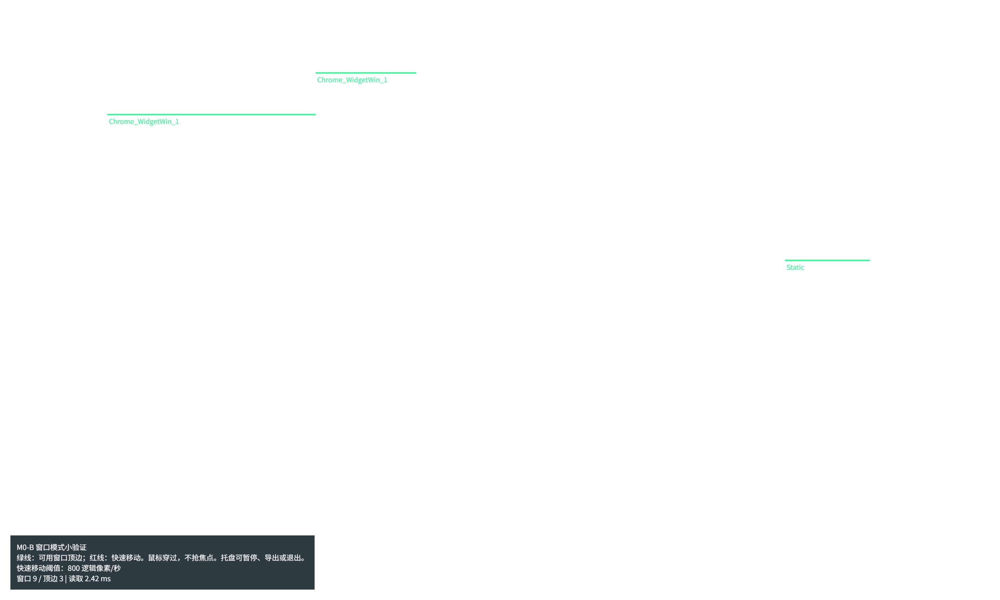
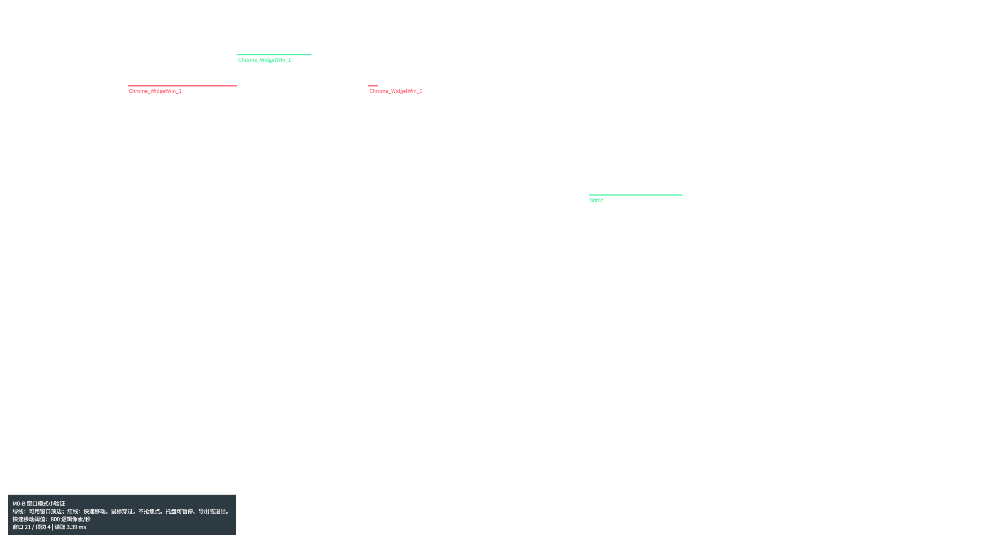
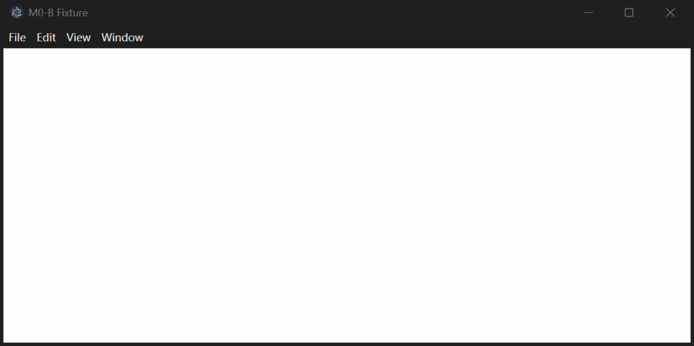

# M0-B 窗口模式小验证

关联：[#3](https://github.com/kasumi-yz/TTCats/issues/3)。工程：`experiments/window-spike/`。

## 结论与范围

独立 Electron + TypeScript + koffi 工程可以枚举真实窗口、读取 DWM 边界和状态，计算窗口顶边，并用透明桌面层约每秒绘制 10 次。笔记本 2880×1800 150% 已实测；台式机主屏 3440×1440 100% 和 2560×1440 100% 均通过 17 项 verify 检查，调试层截图成功。2560 配置前两次启动检查失败，补修等待重建队列后通过，详见下文。台式机测试时还连接一块 1920×1080 100% 副屏，不能视为 D23 单屏环境或多屏兼容性验收。六类应用的移动、最大化识别和读取到的矩形扣除保留历史记录。**六类应用的实际按钮位置尚未验证**，不能把矩形扣除检查写成按钮位置验证通过。

这是 M0 风险验证，不接入 `app/`，不修改共享接口、schema 或 proposed ADR。M4 仍须验证猫的宽度、身体上方空间、自绘按钮、混合 DPI 和实际拖动到屏幕呈现的延迟。

## 环境与命令

- 原始记录 2026-09-30；第二轮审查修正及本次实测 2026-10-01，America/New_York。Windows 内核 10.0.26200。系统注册名称为 Windows 10 Home China，不能据此推断系统大版本。
- AMD Ryzen 9 8945HS，16 个逻辑处理器，约 32 GB 内存；单显示器 2880 × 1800 物理像素，120 Hz。
- 150% 时 Electron 显示范围为 1920 × 1200 逻辑像素，工作区高 1152。
- Node.js 开发环境 24.15.0；Electron 44.5.1、内含 Node.js 24.21.0 / Chromium 152.0.7977.130；koffi 3.3.2。独立 lockfile，不改变根目录依赖。
- 根目录 `npm run check`：123 项单元测试、类型、lint、格式、内容与 schema 检查通过。
- 小工程 `npm test`：8 项规则测试通过，0 跳过；`npm run build` 通过。新增 144 DPI 最短线段用例：12 物理像素可保留，11 物理像素必须排除。
- `npm run verify`：本次 150% 下 17 项真实窗口检查通过；新增 Legacy 按钮区贴右边缘，以及同时请求三次桌面层重建后只保留每屏一个窗口的检查。
- `npm run verify:apps`：六类应用临时移动和最大化，在 finally 中恢复位置与原最大化状态；找不到应用直接失败，不跳过。

台式机补测：2026-10-01，Asia/Shanghai。AMD Ryzen 7 9800X3D，16 个逻辑处理器；主屏 R34U81 为 3440×1440、240 Hz、100%，由用户改为 2560×1440、100% 后运行第二轮。Electron 实际枚举两块活动显示器，副屏 Sculptor 为 1920×1080、100%，原点 `(-1920,352)`；Windows 设置页另显示一个未被 Electron 枚举的屏幕编号。本轮仅核对主屏，不安排副屏、跨屏或混合缩放验收。根目录 check（123 项测试）和小工程 8 项规则测试通过。本轮未运行 verify:apps、measure、可选 --capture-window 或普通 start 的人工拖动验收，不更新笔记本 CPU 数据。

## 审查发现：Codex 透明层遮挡右侧约 44%

旧算法把工具窗口保留为矩形遮挡物。只读查询发现，Codex 桌面应用 `ChatGPT.exe` 有一个窗口覆盖物理范围 `(1608,0)-(2880,1800)`，宽 1272，占屏幕约 44.2%。扩展样式为 `0x2800a8`，包含分层、鼠标穿过、工具窗口和置顶标志。旧 [measure-150-before-review.json](M0-B-证据/measure-150-before-review.json) 的右侧顶边因此被截断；这不是普通窗口的真实遮挡。先前用孤立测试窗口绕开桌面遮挡，没有进一步查明来源，是旧报告遗漏的主要风险。

已修改通用过滤，不按应用名称写特例：分层窗口同时设置 `WS_EX_TRANSPARENT` 时不参与遮挡；可查询的全局 alpha 为 0 时也不参与遮挡。其他工具窗口仍保留遮挡，不能把工具窗口一概删掉。导出的 `ignoredTransparentWindows` 记录过滤原因、样式及物理边界，不记录标题。

新增两个原生测试窗口，分别为鼠标穿过的分层窗口和 alpha 为 0 的分层窗口。旧实现实测失败“透明鼠标穿过层或完全透明层仍参与遮挡”，修改后通过。这个 M0 策略也会忽略有可见装饰的鼠标穿过层；它**不能证明所有透明窗口都被正确识别**。`GetLayeredWindowAttributes` 不能查询通过 `UpdateLayeredWindow` 设置的逐像素透明度，部分透明或圆角的窗口仍按矩形处理。M4 必须重新评估逐像素遮挡和这些装饰层。

依据：[Windows 分层窗口命中测试](https://learn.microsoft.com/en-us/windows/win32/winmsg/window-features)、[GetLayeredWindowAttributes 的限制](https://learn.microsoft.com/en-us/windows/win32/api/winuser/nf-winuser-getlayeredwindowattributes)。

## 六类应用与按钮证据

2026-09-30 的六类应用历史结果见 [apps-150.json](M0-B-证据/apps-150.json)。原生边界均跟随两次测试移动，物理差值为 `(180,40)`；测试还真实最大化每个窗口，确认 `maximized=true` 且不提供窗口顶边。这份历史记录不替代本次 Legacy 按钮区的新回归，也不替代台式机实测。

| 应用       | 识别依据                                           | 已验证                               | 未验证                            |
| ---------- | -------------------------------------------------- | ------------------------------------ | --------------------------------- |
| 资源管理器 | `CabinetWClass`                                    | 移动、最大化、矩形扣除               | 实际按钮位置、不同主题            |
| Chrome     | 窗口标题的公共应用后缀                             | 移动、最大化、矩形扣除               | 自绘标签栏拖动、实际按钮位置      |
| 微信       | `Qt51514QWindowIcon`                               | 移动、最大化、保守矩形扣除           | 右侧 160 逻辑像素是否覆盖实际按钮 |
| VS Code    | 公共应用名称；官方 ZIP 便携版 1.140.0              | 移动、最大化、保守矩形扣除           | 实际按钮位置                      |
| 记事本     | `Notepad`                                          | 移动、最大化、矩形扣除               | 实际按钮位置、跨屏                |
| 设置       | `ApplicationFrameWindow` 且标题为“设置 / Settings” | 应用身份、移动、最大化、保守矩形扣除 | 实际按钮位置                      |

`computeLedges` 扣除按钮矩形后，再检查线段不与该矩形重叠，只能证明几何算法使用了这个输入，不能独立证明输入矩形正确。规则测试验证扣除意图；六类应用的按钮定位仍需独立视觉或系统辅助功能证据。没有有效 DWM 按钮数据时预留右侧 160 逻辑像素，仅为保守退路。

旧数据里的按钮边缘还残留 1～3 物理像素碎线。现已排除短于 8 逻辑像素的线段，并补上规则回归。8 是 M0 去除碎线的阈值，不是猫所需的实际站立宽度。DWM 按钮位置转换仍用 `GetWindowRect` 原点，而不是 DWM 可见边界原点。

## D23 显示配置、DPI 与截图

| D23 实测配置           | 状态与证据                                                                                                                                          |
| ---------------------- | --------------------------------------------------------------------------------------------------------------------------------------------------- |
| 笔记本 2880×1800、150% | 本次 17 项通过；144 DPI。`geometryEvidence.dwmBounds` 为 `(489,330)-(1671,921)`，转逻辑 `(326,220,788,394)`；外框符合已知位置及大小，坐标往返误差 0 |
| 台式机主屏 3440×1440、100% | 用户恢复原分辨率后用最终代码复测，17 项通过，96 DPI；[JSON](M0-B-证据/verify-3440-100.json) 与 [PNG](M0-B-证据/verify-3440-100.png)。外框 `(200,220)-(1000,620)`，DWM `(207,220)-(993,613)`，逻辑 `(207,220,786,393)`，往返误差 0；有副屏，非 D23 单屏环境 |
| 台式机主屏 2560×1440、100% | 用户实际切换后，修正启动检查等待队列后 17 项通过，96 DPI；[JSON](M0-B-证据/verify-2560-100.json) 与 [PNG](M0-B-证据/verify-2560-100.png)。外框 `(200,220)-(1000,620)`，DWM `(207,220)-(993,613)`，逻辑 `(207,220,786,393)`，往返误差 0；有副屏，非 D23 单屏环境 |

1920×1080、100% 按 D23 不单独测，由台式机 2560×1440、100% 的主屏实测代表覆盖坐标配置。本次环境带副屏，单屏环境的严格验收仍未覆盖；不能因副屏恰好为 1080p 就声称另完成 1080p 验收。不再补测 125%，也不安排多屏、混合缩放的手动实测。

保留的历史记录如下，只引用 JSON 中能核对的最终 DWM 边界，不把不同采样时刻的坐标混在一起：

| 历史缩放 | 原始文件中的最终 DWM 边界                                                                              | 标注                                      |
| -------- | ------------------------------------------------------------------------------------------------------ | ----------------------------------------- |
| 100%     | `verify-100.json` 的 Fixture 为 `(507,220)-(1293,613)`，宽 786、高 393；10 项检查                      | **修复前的旧版数据，不在 D23 支持范围内** |
| 125%     | `verify-125.json` 的 Fixture 为 `(633,275)-(1622,767)`，宽 989、高 492；10 项检查，无 geometryEvidence | **修复前的旧版数据，不在 D23 支持范围内** |

历史文件：[100%](M0-B-证据/verify-100.json)、[125%](M0-B-证据/verify-125.json)。笔记本文件：[150%](M0-B-证据/verify-150.json)；台式机文件见上表。各记录均来自实际 Windows 设置，没有用 Electron 强制倍率替代。新版除了坐标往返，还把 Win32 外框与已知的 `(200 或 320,220,800,400)` 逻辑位置及大小比较，误差限 2 物理像素。

速度、最小窗口和按钮退路宽度按窗口所覆盖面积最大的显示器缩放换算；`windowDpi` 记录目标窗口自身 DPI。第二轮审查发现：只改上述三项还不够，Legacy 的 DWM 按钮相对坐标仍有虚拟化。现在先把相对偏移乘以显示器 DPI / 窗口 DPI，再加物理 GetWindowRect 原点。倍率不一致时，按钮预留区保守延伸到 DWM 可见右边缘，避免边框舍入留下缝隙。

本次 Legacy 的 `windowDpi=96`、显示器 `dpi=144`，可见右端 2839，按钮区 `(2504,750)-(2839,818)`，右端误差 0。新增回归要求有效 DWM 按钮区（不能靠退路冒充）贴住右边缘，误差 ≤2 物理像素。旧换算失败，单乘 1.5 倍仍有约 5 像素误差，最终修复后通过。这个原生标准窗口的边界回归不能替代六类应用实际按钮位置的独立验证。

桌面层重建现在通过 Promise 队列串行执行；同时发出的三个重建请求完成后，检查每个显示器只剩一个有效桌面层，没有额外 BrowserWindow。显示器事件的重建错误会明确输出并退出。DPI 上下文切换和恢复都检查返回值，切换失败时不会拿 0 去恢复。

台式机 2560 配置的前两次启动在 `serialized-overlay-rebuild` 检查处失败（退出码 1），未创建测试窗口、未生成本轮 JSON 或 PNG；退出时另报 `ERR_FAILED (-2) loading overlay.html`。[失败记录](M0-B-证据/verify-2560-100-first-attempt.txt) 保留这两次尝试，未使用上一轮遗留图片。测试原先只等待自身提交的三个重建请求；系统显示器事件仍可能追加重建，断言会碰到中间状态。现等待当前队列，并在队列引用改变时继续等待，直到所有追加请求完成，再执行原有窗口数量及销毁检查，没有降低验收条件。修正后 2560 配置通过；用户随后恢复 3440×1440、100%，用同一份最终代码复测通过，并替换 3440 的 JSON 与 PNG，两种配置提交的证据均对应本次最终代码。本次没有 Windows Graphics Capture 超时，普通 verify 的透明调试层截图成功；这不是可选系统窗口捕获的成功证明。

### 公开证据的删减口径

- `verify-150.json` 及台式机两份 verify JSON 的 windows 只保留 `M0-B` 测试窗口（标题是公开测试名称）；删除其他窗口整项。ledges 按这份保留后的窗口列表重新计算，fastWindowIds 也只保留测试窗口 ID；它们不是完整用户桌面的快照。displays 保留实际活动显示器，未删掉副屏来伪装单屏环境。
- 历史 `verify-100.json`、`verify-125.json` 删除了非测试窗口和整份 ledges，不能由这些历史文件重建完整遮挡结果。
- 本次及旧版 measure 文件只从每个窗口对象删除私人 title，保留边界、窗口类名、状态、按钮数据、DPI、ledges 和统计；本次另保留 ignoredTransparentWindows 过滤证据。
- 截图只公开透明调试层或独立测试窗口，不包含用户窗口内容。两张分开的图片不是完整桌面最终对齐的照片。

本次普通 verify 保存了新的透明层截图。可选 `--capture-window` 本次未运行；2026-09-30 的测试窗口参考图仍保留，并明确作为历史图。此前一次可选捕获曾遇到 Windows Graphics Capture 超时，失败会返回非零退出码，不能计为已通过，也不属于本次 17 项检查。

台式机 PNG 是普通 verify 内 `webContents.capturePage()` 保存的原始透明调试层，主屏工作区高度为 1392，图片尺寸分别为 3440×1392 和 2560×1392；不含任务栏和私人窗口标题。只展示测试窗口对应的线及窗口类名，不能当作整块物理桌面与窗口最终对齐的照片。未做图片替换或重新绘制。

## 跟随观察、延迟与 CPU 口径

用户实际拖动后曾反馈错位、移动后消失和拖动期间消失。依次修复桌面层绘制区 CSS 宽高、`GetWindow` 链表实时换序重复句柄（改为 `EnumWindows`）、以及活动窗口盖住桌面层（每次采样重新置顶且不获取焦点）。用户随后确认绿线正常。这个人工结果证明所观察窗口的跟随可见性，不是所有应用的按钮视觉验收，也不是带时间戳的拖动延迟测量。

`commandedMovementToRendererAckMs` 是测试程序发出移动命令，到新边界的渲染回执；含命令文件接收端最多 50 ms 等待和正常约 100 ms 轮询等待。本次 `verify-150.json` 记录 5 次，平均 80.91 ms，P95 96.00 ms，峰值 99.03 ms，只代表程序移动的代理指标。历史 `verify-100.json` / `verify-125.json` 的平均为 77.76 / 93.58 ms，均是 D23 范围外旧记录。删去旧报告无法在当前 JSON 核对的 82.08 ms。`sampleToRendererAckMs` 从读取开始到下一动画帧回执，不保证屏幕已呈现。**真实鼠标拖动开始到屏幕呈现的延迟尚未测量**；M4 需要独立方法。

台式机最终代码的同一代理指标：3440 配置 5 次，平均 82.58 ms、P95 97.56 ms、峰值 100.76 ms；2560 配置 5 次，平均 99.83 ms、P95 99.11 ms、峰值 127.29 ms。它们不代表真实屏幕呈现延迟；本次未运行 measure，不能使用短 verify 的 CPU 字段作为新的性能结论。

本次按用户确认的独占环境运行 30 秒，新算法结果见 [measure-150.json](M0-B-证据/measure-150.json)：277 次读取，墙钟耗时平均 2.14 ms、P95 2.94 ms、峰值 3.45 ms；实际间隔平均 108.71 ms。窗口读取区间累计 CPU 为 515000 µs，单核平均约 1.72%，按 16 个逻辑处理器总容量粗略归一化约 0.11%。读取开始到渲染回执 P95 3.72 ms，不等于实际拖动呈现延迟。

`pollingMs` 是墙钟耗时，CPU 是窗口读取区间的进程累计 CPU 时间，不能混用。本机的 CPU 样本出现约 16 ms 计数阶梯，单次 CPU 样本及其 P95 不能代表一次查询消耗；只看长时间累计量与平均百分比。CPU 数据仅统计窗口轮询，不是完整桌宠的性能验收。旧 [measure-150-before-review.json](M0-B-证据/measure-150-before-review.json) 保留为历史基线（单核 2.44%），桌面窗口组成不同，不据此宣称性能提升。

测量前由会话以中文提醒暂停其他会话，等用户回复“已暂停”，再用进程查询确认没有其他 Electron 或素材工厂；测量结束后再次检查没有这些进程。**measure 命令本身没有进程检查或自动独占锁**，独占条件由会话人工确认和外部进程检查保证，不能写成程序自动拒绝。普通用户应用可以保持运行。

## 给 M4 的建议与未覆盖范围

1. 将上述 Codex 透明层作为固定回归场景，不能照搬“所有工具窗口都遮挡”的旧规则。逐像素透明、自绘装饰和部分透明仍需独立策略。
2. 窗口顶边是一条线，不足以判定猫的身体能否完整显示。需要按猫的宽度、身体高度和落脚锚点计算上方空间，扣除上层窗口在顶边上方的覆盖；离屏幕顶部仅约 20 逻辑像素的顶边也应按身体空间淘汰。当前测试“上层窗口下边缘恰好等于顶边时不挡住线”只描述线段几何，不能直接作为站立规则。
3. 还要按显示器范围裁剪窗口顶边。多显示器、混合缩放和跨屏窗口当前未验证，也不在 D23 的手动实测分工内，不能据本报告保证这些场景。
4. 160 逻辑像素的按钮退路不是通用按钮尺寸。自绘按钮需要逐类视觉或辅助功能证据；最短长度要改用猫实际所需宽度。
5. 快速移动以 800 逻辑像素/秒检测，只测试了采样间的移动。一个 100 ms 间隔内往返的晃动可能漏检，应补充窗口事件或更高频的运动采样，再决定玩法阈值。
6. 全屏、隐藏、最小化、恢复和多个重叠窗口用真实测试进程切换；六类应用新版另实测最大化。不同应用的特有全屏、置顶层和圆角尚未逐一验证。
7. 退出时的最后一条回执必须先检查窗口是否已销毁；保留真实退出回归。
8. `EnumWindows` 返回顺序等于 Z 序是本实验的假设，Windows 文档没有明确保证。300 次换序只检查重复句柄，不验证遮挡顺序；M4 必须用独立 Z 序来源或已知重叠场景交叉验证。

台式机主屏两种分辨率的真实 verify 与截图已补齐，均通过；本次带副屏，未完成严格单屏环境验收，也不声明多屏兼容性通过。所有应用实际按钮位置、真实拖动呈现延迟及完整桌面对齐照片仍是已声明的验证限制；D23 不安排混合 DPI 手动实测。新增的启动检查等待队列修正还需 Claude 复审，CI 全部通过后由用户在 GitHub 合并。
