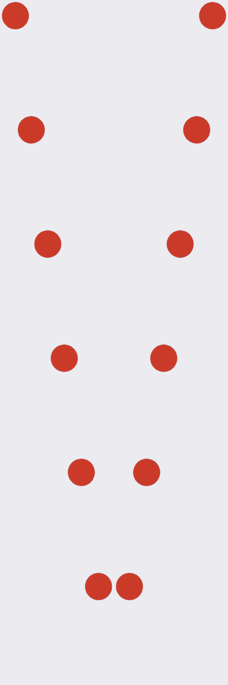

# M0-C：素材工厂 v0 验证报告

日期：2026-10-01。关联 #4，按已合并 #18 的点击遮罩、片段与候选 schema 对接。

## 结论与验收范围

已实现并验证 `ingest → matte → suggest → confirm → finalize`，使用合成片段完成当前可执行的验收：
真实 GPU 抠图、透明 VP9 WebM、逐帧点击遮罩、共享片段与候选档案校验，以及 M0-A 技术验证小样中的 PixiJS 播放。

**没有豆豆的真实片段**，收件箱只有 #6 生成的红球测试视频。因此按 #4 的约定先用合成视频走通。
本文不能证明豆豆毛边、项圈挂件、走路脚底打滑或身份保持已经合格；ADR-0002 的真实猫复测仍待 #7。
素材工厂的工程实现与合成验收完成，不将真实猫的美术验收标为通过。

## 环境、模型和来源

- Windows、本机 RTX 5090 D v2，nvidia-smi 显示总显存 24455 MiB。
- Python 3.12.10、uv 0.12.21、ffmpeg 9.0.2、Node 24.15.0。
- BiRefNet-general-lite，bb_swin_v1_tiny，epoch_232，ONNX Runtime GPU 1.26.0。
- 固定文件 `BiRefNet-general-bb_swin_v1_tiny-epoch_232.onnx`，224005088 字节。
- 发布者 MD5：`4fab47adc4ff364be1713e97b7e66334`。
- 本机 SHA-256：`5600024376f572a557870a5eb0afb1e5961636bef4e1e22132025467d0f03333`。
- 许可证 MIT；[模型来源与许可证](https://huggingface.co/ZhengPeng7/BiRefNet)、
  [发布文件和校验值](https://github.com/danielgatis/rembg/blob/main/rembg/sessions/birefnet_general_lite.py)。
- 实际 provider 包含 `CUDAExecutionProvider` 和 `CPUExecutionProvider`。主模型启用 CUDA，部分形状运算允许 CPU provider；不声称每个算子都在 GPU 上。
- 不复用或修改 ComfyUI 的 Python 环境；GPU 运行库安装在素材工厂的独立虚拟环境。
- 模型、原始素材和处理产物留在仓库外的 `D:\TTCats-素材库`，由 `TTCATS_ASSET_ROOT` 指定。

开始 GPU 验证时没有发现其他素材工厂、ComfyUI 或 Electron 在运行；M0-A 只在抠图结束后启动。
下面耗时是单次处理记录，包含该阶段初始化和文件处理，不是多轮性能基准，也没有测 GPU/内存峰值。

## 两组全流程证据

| 阶段 | 程序绘制的循环球：17 帧、64×64、8fps | H3 测试红球：124 帧、1344×768、24fps |
| --- | ---: | ---: |
| ingest | 0.130 秒 | 0.209 秒 |
| matte（真实 GPU） | 5.855 秒 | 69.745 秒 |
| suggest | 0.044 秒 | 0.669 秒 |
| confirm（校验/写入，不是人挑片耗时） | 0.002 秒 | 0.003 秒 |
| finalize | 1.281 秒 | 5.213 秒 |

### 程序绘制的循环球

复现：`uv run --extra gpu python scripts/run-synthetic.py`，任务 `clip-10148e280dcc48fd`。
程序绘制首尾相同的循环运动，真实 AI 抠图后按锚点原地化；仅对本脚本的合成测试自动确认。

- 输出 384×384、8fps、17 帧，真实时长 2.125 秒。
- 遮罩每帧 1152 字节，总计 19584 字节。
- 解码后的透明像素 1090504 个，不透明像素 782315 个。
- 首尾 alpha 最大差为 **0**；CPU 合成集成测试另验证首尾解码 RGBA 完全相同。
- `ClipSchema`、`CandidateManifestSchema` 通过；逐帧遮罩与桌宠 TypeScript 实现逐字节一致。
- 资料、处理后帧、WebM、遮罩及素材档案：
  `D:\TTCats-素材库\factory\clip-10148e280dcc48fd\finalize\`。

### H3 的既有原始视频

来源：`D:\TTCats-素材库\inbox\h3-20261001-035131-11fcbb09-1.mp4`，
SHA-256 `ce94ddaf7d62e408133445a5f0f865ef60678f6941cd56f65fafa03d0d97258a`。
生成器档案原样保留。其模型与生成证据见 M0-E 报告；本轮没有再次生成 H3 原始视频。

任务 `clip-7fb981a96fd54feb`；试用 RGB 0,255,255 作为纯色背景参数。
人工确认记录的 `manual_seconds` 为 0，备注明确由 Codex 仅接受合成红球以验证工具链，**不是用户的真实猫验收**。
正式候选档案注明 MiniMax H3 FL2VA INT8 / ComfyUI 0.38.0、实际四个量化模型文件、工作流哈希、提示词、种子、20 步、实际生成次数和原视频路径。

- 建议的循环区间 `[27, 122)`，导出 95 帧、306×300、24fps，时长 3.958 秒。
- 点击遮罩每帧 722 字节，总计 68590 字节。
- 解码后的透明像素 2564417 个，不透明像素 5477880 个。
- 两份共享 schema 通过，遮罩与桌宠实现逐帧一致。
- 首尾 alpha 最大差为 **100**：相似度建议不能证明动作无跳变。本测试只证明处理链路可用，不将 H3 候选当成美术合格片段。
- 产物和日志：`D:\TTCats-素材库\factory\clip-7fb981a96fd54feb\finalize\`，
  `D:\TTCats-素材库\factory-logs\`。
- 早一版导出移到同任务的 `finalize-before-candidate-manifest`，保留旧结果供追溯。

深浅背景及镜像预览（左原版、右镜像，均为抠图后的合成测试）：

它们不能代替豆豆蓬松毛发、项圈挂件或麻将深色毛发的检查。

## M0-A 技术验证小样复测

复现脚本 `scripts/verify-spike.mjs` 将小样复制到素材库，保留原有 PixiJS VideoSource/Texture 播放代码，
替换合成站着待机片段。仅给外部副本控制通道增加端口文件；没有改 `experiments/` 的仓库文件。

实际 Electron 44.5.1 / PixiJS 8.21.0，在 3440×1440、100% 桌面上运行，桌面层可用区域 3440×1392。
把三只测试猫并排放置，8 次采样均读到 3 只、播放 `loop_stand`，帧号随时间推进并跨越循环末尾回到 0。
画面同时含透明背景与可见主体；无 renderer pageerror。
复测只针对视频格式与循环播放，不重新宣称鼠标交互和整机性能验收。

原始证据：`D:\TTCats-素材库\factory-tests\spike-1790844103268\result.json` 与 `overlay.png`。
图中仍沿用 M0-A 的三只测试猫着色，不代表猫的真实外观。

## 测试与问题修复

- `uv sync`、`uv run ruff check`：通过。
- `uv run pytest`：33 项通过，无跳过。包括小型合成视频完整链路、缺帧、透明主体为空、schema 错误、越界锚点、未确认候选、缺失或错误素材档案、片段语义、关键点长度、亚像素锚点、音轨裁剪/Opus、来源被修改、去色边和失败不覆盖旧产物。
- AI 模型在单元测试中是明确标注的替身；上面的 GPU 记录才是真实推理证据。
- `verify-contract.mjs`：直接调用正式共享 Zod schema 和点击遮罩编码器，两组导出均通过。
- `verify-spike.mjs`：M0-A 真实桌面层播放通过，结束时关闭本次启动的 Electron。
- 同步最新 main 后 `npm run check`：类型检查、lint/格式、142 项单元测试、内容校验和 schema 最新检查通过。CI 的最终结果以本 PR 检查记录为准。

遇到并修复的问题：

1. Windows 的 cuDNN 主库能预载，但引擎子库最初找不到，H3 抠图首次失败，耗时 3.572 秒。
   为本进程加入独立虚拟环境的 DLL 搜索目录后成功。失败没有发布半截抠图结果，没有修改全局 PATH。
2. WebM 编码后软边 alpha 与编码前 PNG 有最大 1 级的差别，使个别格子的命中结果变化。
   改为从最终 WebM 解码 alpha 生成遮罩；添加软边回归测试，并用 TypeScript 逐帧交叉核对。
3. 首次 Linux CI 没有 ffmpeg/ffprobe，完整视频测试因此失败，没有跳过。
   在允许目录内添加固定版本的 Linux x86_64 开发依赖；pytest 优先用系统工具，缺失时使用 uv.lock 校验的 wheel 二进制。
   仅修改测试进程 PATH，不改 CI 工作流、系统安装或日常 CLI。

## 人工改动量与 v1 建议

本次没有用户人工挑片，用时写为 0，不能据此估算猫素材的真实制作成本。
循环球复现脚本把循环区间改为已知首尾相同的 `[0,17)`；改动保留在确认日志。
单元测试模拟改步速和一帧锚点，验证能记录改动字段、锚点数量及 30 秒人工耗时；这不是实际制作时间。

真实素材需要逐项确认裁剪区间、循环点、锚点和步速。建议值的局限已写入输出文件：
底部轮廓可能选到尾巴/阴影；位移可能来自镜头；首尾形状相似不表示运动自然。

v1 优先改善逐帧锚点的可视化编辑、连续播放和循环接缝对比，再根据真实片段数据判断哪些步骤能自动化。
真实豆豆片段到位后，应先检查毛边、挂件、身份和脚底打滑；不合格时再评估更大 BiRefNet 或改背景/生成方式。
现在没有自动评分，也没有预写后续阶段的占位实现。

## 后续人工验收

#7 提供真实豆豆片段后，按 README 运行同一流程，在深浅背景下看毛边和项圈，再确认身份及动作链。
这是已知的内容缺口，不需要为本次工具链合成验收临时制作猫素材。
Claude 交叉审查和用户点击合并按仓库流程另行完成；本报告不将它们视为已经通过。
